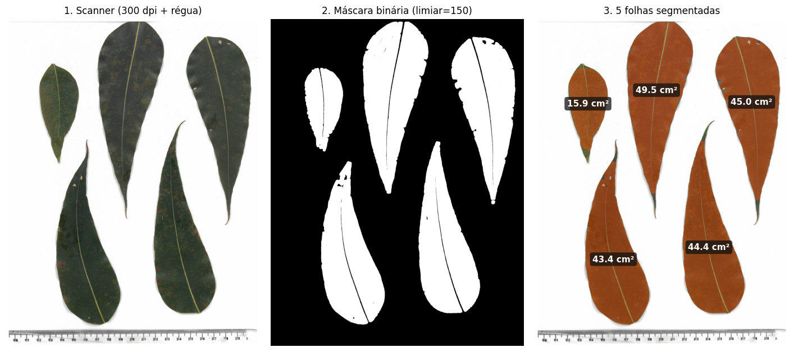

<div align="center">


# leaf-area-cv

### Automated **leaf area measurement** from flatbed-scanned leaves

*A desktop scanner, a ruler and ~2 seconds per image replace hours on a benchtop meter.*

[](https://www.python.org/)
[](https://opencv.org/)
[](https://scikit-image.org/)
[](https://jupyter.org/)
[](LICENSE)

[Português](README.md) · **[English](README.en.md)**

</div>

---

<div align="center">

<sub><i>Actual output of this repository: 5 scanned eucalyptus leaves, segmented and measured automatically.</i></sub>
</div>

---

## The problem

Leaf area measurement is one of the most repetitive tasks in agronomic and forestry research.
The usual routes are either expensive or slow:

| Method | Cost | Time per leaf | Destructive |
|---|---|---|---|
| Benchtop optical meter (LI-3100, CI-202…) | USD 6–15k | ~5 s | yes |
| Graph paper / cut-and-weigh | low | 2–5 min | yes |
| Allometric models (length × width) | low | ~1 min | no |
| **This repository** | **any flatbed scanner** | **~0.4 s** | yes |

If you already own a flatbed scanner, the marginal cost is zero.

## What the code does

1. Reads each scanned image and converts it to grayscale.
2. **Inverts** the mask so the scanner's white background becomes zero.
3. **Thresholds** at a fixed value, separating leaf tissue (dark) from background (light).
4. **Morphological opening** with a 30×30 px elliptical structuring element, removing dust,
   fibres and the thin tick marks of the ruler.
5. **Labels connected regions** and measures each region's area in pixels.
6. **Converts px² → cm²** using the calibration factor derived from the ruler in the image.
7. Discards regions smaller than 1 cm² (residual noise and ruler markings).
8. Exports **one `.xlsx` spreadsheet per folder**, one row per leaf.

The `IAF_comp_larg` variant additionally reports each leaf's **length** and **width**, taken
from the major and minor axes of the equivalent ellipse (`regionprops`).

## Quick start

```bash
git clone https://github.com/igorleite91/leaf-area-cv.git
cd leaf-area-cv
pip install -r requirements.txt

# run on the sample set bundled with the repository
cd exemplos
python ../scripts/IAF_calc.py
```

Expected output — `Fazenda_Exemplo_01.xlsx` with 10 rows (5 leaves × 2 images):

| Imagem | IAF |
|---|---|
| A1_I.1.jpg | 49.4512 |
| A1_I.1.jpg | 45.0063 |
| A1_I.1.jpg | 15.8868 |
| A1_I.1.jpg | 44.3997 |
| A1_I.1.jpg | 43.3875 |
| A1_I.1_semRegua.jpg | 49.4503 |
| … | … |

*(areas in cm², one row per detected leaf; values verified against scikit-image 0.26 / OpenCV 4.x)*

The two sample images are the same scene with and without the ruler in frame. The areas
differ only in the fourth decimal place — meaning **the ruler does not contaminate the
measurement**, because morphological opening plus the 1 cm² cutoff remove it.

## Expected folder layout

The script walks `./Digitalizadas`, treats **each subfolder as a group** (plot, farm,
treatment, block…) and writes one spreadsheet per group:

```
Digitalizadas/
├── Fazenda_Exemplo_01/     →  Fazenda_Exemplo_01.xlsx
│   ├── A1_I.1.jpg
│   └── A1_I.1_semRegua.jpg
├── Treatment_T2/           →  Treatment_T2.xlsx
└── Block_III/              →  Block_III.xlsx
```

## Calibration — read this before using your own data

> [!IMPORTANT]
> **The conversion factor is specific to your scanner.** The values below hold for the
> bundled sample images (300 dpi). Without adjustment, every area will be off by a constant
> factor.

```python
comprimento_régua_cm     = 1    # reference length, in cm
comprimento_régua_pixels = 118  # the SAME length, measured in pixels on your image
```

How to measure it: scan a ruler alongside the leaves, open the image in any viewer that
reports pixel coordinates (GIMP, ImageJ, Paint), and count the pixels between two 1 cm marks.

Shortcut via scanner resolution — `pixels_per_cm = dpi / 2.54`:

| Resolution | px per cm |
|---|---|
| 150 dpi | 59 |
| **300 dpi** | **118** ← used in the samples |
| 600 dpi | 236 |

### Other tunable parameters

| Parameter | Default | When to change it |
|---|---|---|
| `limiar` (threshold) | `150` (`100` in the length/width variant) | Pale or chlorotic leaves need a lower threshold; a greyish background needs a higher one |
| `janela_suavizacao` (opening kernel) | `(30, 30)` | Decrease for small leaves (needles, grasses); increase if debris survives |
| `area < 1 cm²` cutoff | `1` | Raise or lower it if your leaves are smaller than 1 cm² — otherwise they are discarded along with the noise |

## Scanning best practices

- **Clean white background.** The scanner's white lid is enough; crumpled paper casts shadows
  that the threshold reads as tissue.
- **Keep leaves from touching.** Two touching leaves become one region and their areas are summed.
- **Include the ruler in the same image**, flat on the glass, so calibration tracks any
  change in resolution.
- **300 dpi is plenty** for tree leaves. Higher resolutions only cost time.
- **Avoid strongly curled leaves.** Projected area underestimates true area; press them first
  when possible.

## Repository contents

```
leaf-area-cv/
├── scripts/
│   ├── IAF_calc.py              # leaf area, batch over folders → .xlsx
│   └── IAF_comp_larg.py         # area + length + width → .xlsx
├── notebooks/
│   ├── 01_areaFoliar_imagem_unica.ipynb     # tutorial: one image, step by step
│   ├── 02_areaFoliar_lote.ipynb             # batch processing
│   └── 03_area_comprimento_largura.ipynb    # + visual threshold inspection
├── exemplos/Digitalizadas/Fazenda_Exemplo_01/
│   ├── A1_I.1.jpg               # 5 eucalyptus leaves + ruler, 300 dpi
│   └── A1_I.1_semRegua.jpg      # same scene without the ruler
└── docs/img/
```

All three notebooks already point at the bundled sample set — open any of them from the
`notebooks/` folder and run all cells, with nothing to configure. The outputs committed to
this repository were produced exactly that way, on the images shipped alongside the code.

> **Tip:** notebook `03` includes a visual inspection cell that overlays the mask on the
> original image. Use it to calibrate `limiar` before running the full batch.

## Accuracy and limitations

Worth being explicit about what this method is and is not:

- **It measures projected area**, not surface area. For flat leaves the two are close; for
  leaves with a prominent midrib or curled margins, area is underestimated.
- **The column name does not describe the quantity.** `IAF_calc.py` writes the column as
  `IAF` and `IAF_comp_larg.py` as `AFE`, but in **both cases the value is individual leaf area
  in cm²** — neither Leaf Area Index (LAI) nor Specific Leaf Area (SLA). For LAI, sum the
  sample's areas and divide by the corresponding ground area; for SLA, divide area by the
  leaf's dry mass. The names were kept for compatibility with spreadsheets already in use —
  rename them in your own pipeline if you prefer clarity.
- **`Comprimento` (length) and `Largura` (width)** are the major and minor axes of the
  *second-moment-equivalent ellipse*, computed by `skimage.measure.regionprops`. They are
  excellent morphometric descriptors and correlate strongly with caliper measurements, but
  they are not identical to them — particularly for asymmetric or falcate leaves.
- **`regionprops` renamed its properties.** As of scikit-image 0.26, `major_axis_length` and
  `minor_axis_length` are deprecated and will be removed in version 2.0, in favour of
  `axis_major_length` and `axis_minor_length`. `requirements.txt` caps the version at `<2.0`
  for that reason; when migrating, just swap the two names in `IAF_comp_larg.py`.
- **Fixed global threshold.** This works very well against a controlled white scanner
  background. For field photographs with uneven lighting, adaptive thresholding (local Otsu)
  or colour-index segmentation would perform better.
- **Touching leaves are counted as one.** Separate them on the glass.

## Applications

Leaf area and morphometrics feed directly into:

- **Plant phenotyping** — genotype screening, breeding trials
- **Silviculture** — eucalyptus, pine; growth tracking and fertilisation response
- **Plant pathology** — disease severity quantification (lesion area / total area)
- **Ecophysiology** — specific leaf area (SLA), when combined with dry mass
- **Plant nutrition** — normalising nutrient contents per unit area
- **Teaching** — a compact, real-world example of mathematical morphology and region analysis

## Installation

```bash
pip install -r requirements.txt
```

Or individually:

```bash
pip install opencv-python scikit-image pandas openpyxl matplotlib numpy
```

## Citing

If this code is useful in academic work, citation metadata lives in
[`CITATION.cff`](CITATION.cff) — GitHub renders BibTeX/APA automatically via the
**"Cite this repository"** button in the sidebar.

## Contributing

Issues and pull requests are welcome. Improvements that would genuinely help:

- [ ] Automatic Otsu thresholding, removing the manual tuning step
- [ ] Automatic ruler detection, removing manual calibration
- [ ] Watershed separation of overlapping leaves
- [ ] A GUI or a proper CLI with arguments
- [ ] Cross-validation against a commercial optical meter

## License

[MIT](LICENSE) — free to use, including commercially. Attribution appreciated.

---

<div align="center">
<sub>Built by <a href="https://github.com/igorleite91">Igor Leite</a> · If it helped, leave a ⭐</sub>
</div>
